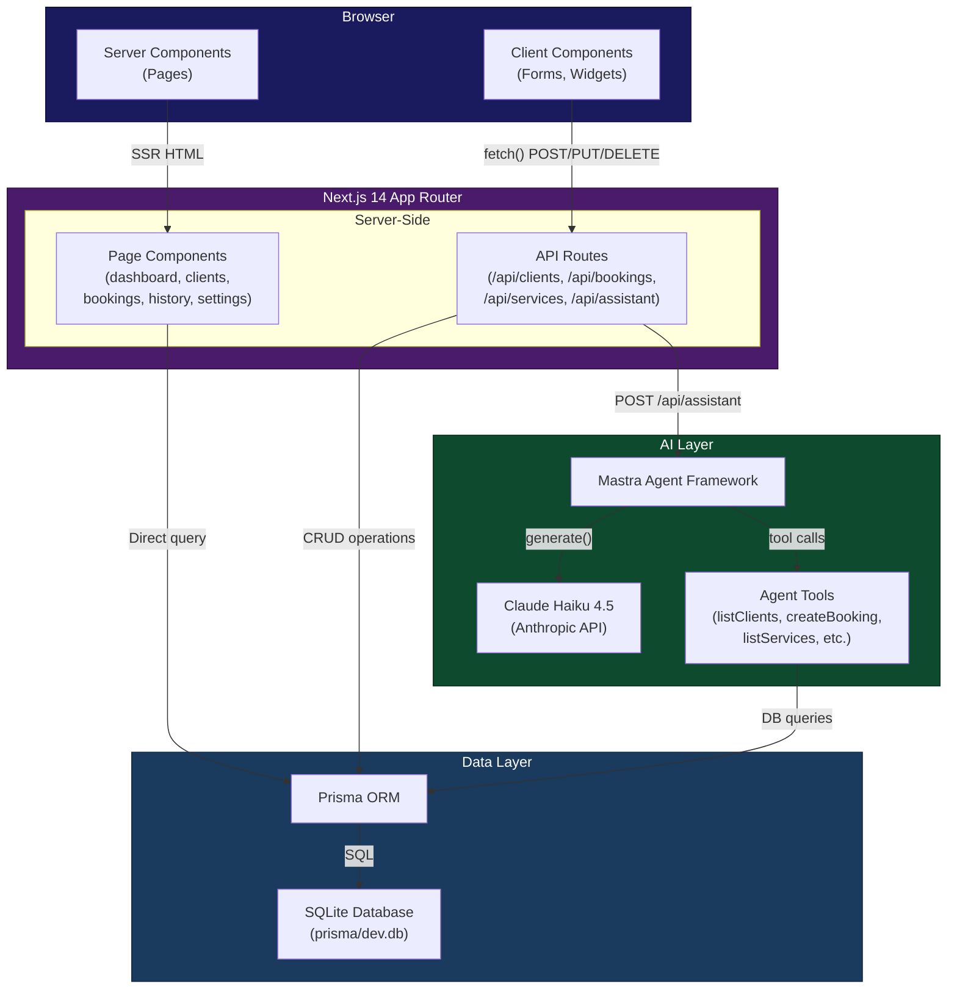
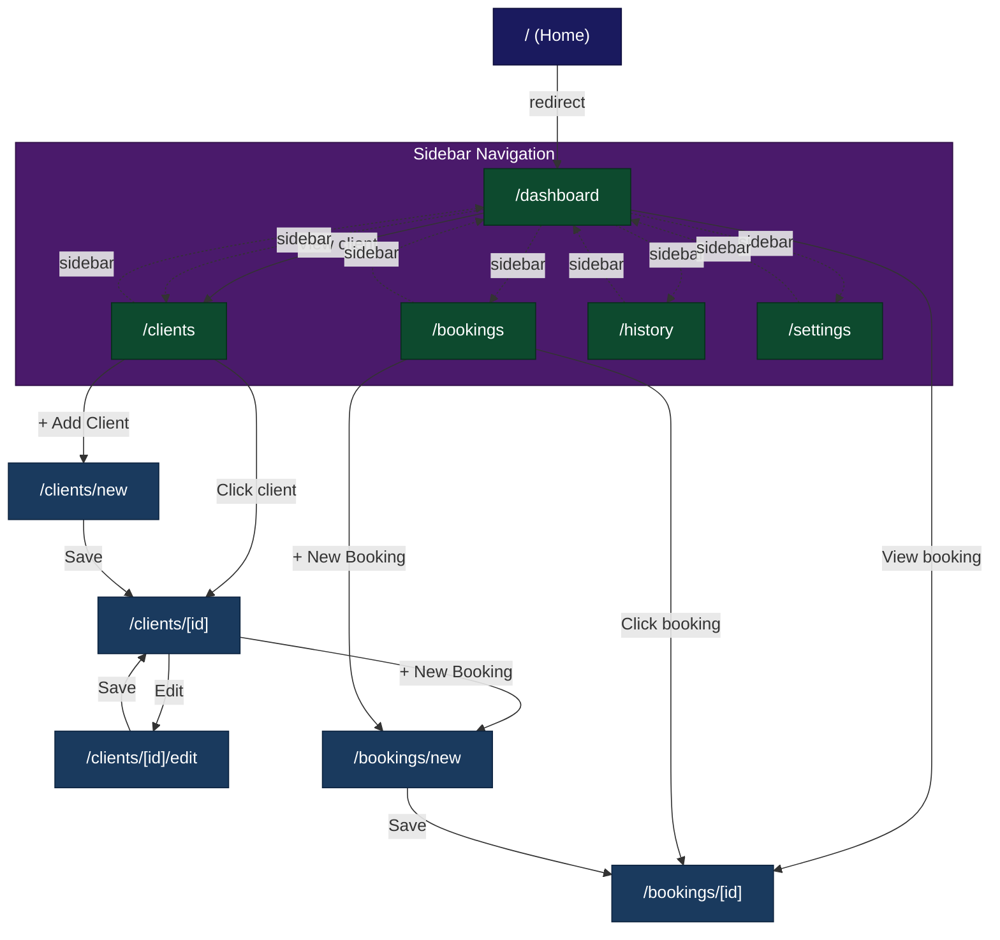
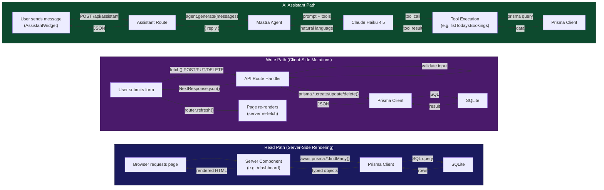

# High-Level Design — Sunshine Hot Cars

## 1. System Architecture

```mermaid
graph TB
    subgraph Browser["Browser"]
        SC["Server Components<br/>(Pages)"]
        CC["Client Components<br/>(Forms, Widgets)"]
    end

    subgraph NextJS["Next.js 14 App Router"]
        subgraph ServerSide["Server-Side"]
            Pages["Page Components<br/>(dashboard, clients,<br/>bookings, history, settings)"]
            API["API Routes<br/>(/api/clients, /api/bookings,<br/>/api/services, /api/assistant)"]
        end
    end

    subgraph AI["AI Layer"]
        Mastra["Mastra Agent Framework"]
        Claude["Claude Haiku 4.5<br/>(Anthropic API)"]
        Tools["Agent Tools<br/>(listClients, createBooking,<br/>listServices, etc.)"]
    end

    subgraph Data["Data Layer"]
        Prisma["Prisma ORM"]
        SQLite["SQLite Database<br/>(prisma/dev.db)"]
    end

    SC -->|"SSR HTML"| Pages
    CC -->|"fetch() POST/PUT/DELETE"| API
    Pages -->|"Direct query"| Prisma
    API -->|"CRUD operations"| Prisma
    API -->|"POST /api/assistant"| Mastra
    Mastra -->|"generate()"| Claude
    Mastra -->|"tool calls"| Tools
    Tools -->|"DB queries"| Prisma
    Prisma -->|"SQL"| SQLite

    style Browser fill:#1a1a5e,stroke:#0d0d3b,color:#fff
    style NextJS fill:#4a1a6b,stroke:#2e0e45,color:#fff
    style AI fill:#0d4a2e,stroke:#072e1b,color:#fff
    style Data fill:#1a3a5e,stroke:#0d2440,color:#fff
```

## 2. Page Navigation Flow

```mermaid
flowchart TD
    Home["/  (Home)"] -->|redirect| Dashboard

    subgraph MainNav["Sidebar Navigation"]
        Dashboard["/dashboard"]
        Clients["/clients"]
        Bookings["/bookings"]
        History["/history"]
        Settings["/settings"]
    end

    Dashboard -->|"View client"| Clients
    Dashboard -->|"View booking"| BookingDetail

    Clients -->|"+ Add Client"| NewClient["/clients/new"]
    Clients -->|"Click client"| ClientDetail["/clients/[id]"]
    NewClient -->|"Save"| ClientDetail
    ClientDetail -->|"Edit"| EditClient["/clients/[id]/edit"]
    ClientDetail -->|"+ New Booking"| NewBooking
    EditClient -->|"Save"| ClientDetail

    Bookings -->|"+ New Booking"| NewBooking["/bookings/new"]
    Bookings -->|"Click booking"| BookingDetail["/bookings/[id]"]
    NewBooking -->|"Save"| BookingDetail

    Dashboard -.->|sidebar| Clients
    Dashboard -.->|sidebar| Bookings
    Dashboard -.->|sidebar| History
    Dashboard -.->|sidebar| Settings
    Clients -.->|sidebar| Dashboard
    Bookings -.->|sidebar| Dashboard
    History -.->|sidebar| Dashboard
    Settings -.->|sidebar| Dashboard

    style MainNav fill:#4a1a6b,stroke:#2e0e45,color:#fff
    style Home fill:#1a1a5e,stroke:#0d0d3b,color:#fff
    style Dashboard fill:#0d4a2e,stroke:#072e1b,color:#fff
    style Clients fill:#0d4a2e,stroke:#072e1b,color:#fff
    style Bookings fill:#0d4a2e,stroke:#072e1b,color:#fff
    style History fill:#0d4a2e,stroke:#072e1b,color:#fff
    style Settings fill:#0d4a2e,stroke:#072e1b,color:#fff
    style NewClient fill:#1a3a5e,stroke:#0d2440,color:#fff
    style ClientDetail fill:#1a3a5e,stroke:#0d2440,color:#fff
    style EditClient fill:#1a3a5e,stroke:#0d2440,color:#fff
    style NewBooking fill:#1a3a5e,stroke:#0d2440,color:#fff
    style BookingDetail fill:#1a3a5e,stroke:#0d2440,color:#fff
```

## 3. Data Flow

```mermaid
flowchart LR
    subgraph ReadPath["Read Path (Server-Side Rendering)"]
        direction LR
        PageReq["Browser requests page"] --> ServerComp["Server Component<br/>(e.g. /dashboard)"]
        ServerComp -->|"await prisma.*.findMany()"| PrismaR["Prisma Client"]
        PrismaR -->|SQL query| DBR["SQLite"]
        DBR -->|rows| PrismaR
        PrismaR -->|typed objects| ServerComp
        ServerComp -->|"rendered HTML"| PageReq
    end

    subgraph WritePath["Write Path (Client-Side Mutations)"]
        direction LR
        UserAction["User submits form"] -->|"fetch() POST/PUT/DELETE"| APIRoute["API Route Handler"]
        APIRoute -->|"validate input"| APIRoute
        APIRoute -->|"prisma.*.create/update/delete()"| PrismaW["Prisma Client"]
        PrismaW -->|SQL| DBW["SQLite"]
        DBW -->|result| PrismaW
        PrismaW -->|JSON| APIRoute
        APIRoute -->|"NextResponse.json()"| UserAction
        UserAction -->|"router.refresh()"| PageReq2["Page re-renders<br/>(server re-fetch)"]
    end

    subgraph AIPath["AI Assistant Path"]
        direction LR
        Chat["User sends message<br/>(AssistantWidget)"] -->|"POST /api/assistant"| AssistantAPI["Assistant Route"]
        AssistantAPI -->|"agent.generate(messages)"| Agent["Mastra Agent"]
        Agent -->|"prompt + tools"| LLM["Claude Haiku 4.5"]
        LLM -->|"tool call"| ToolExec["Tool Execution<br/>(e.g. listTodaysBookings)"]
        ToolExec -->|"prisma query"| PrismaAI["Prisma Client"]
        PrismaAI -->|data| ToolExec
        ToolExec -->|"tool result"| LLM
        LLM -->|"natural language"| Agent
        Agent -->|"{ reply }"| AssistantAPI
        AssistantAPI -->|JSON| Chat
    end

    style ReadPath fill:#1a1a5e,stroke:#0d0d3b,color:#fff
    style WritePath fill:#4a1a6b,stroke:#2e0e45,color:#fff
    style AIPath fill:#0d4a2e,stroke:#072e1b,color:#fff
```
