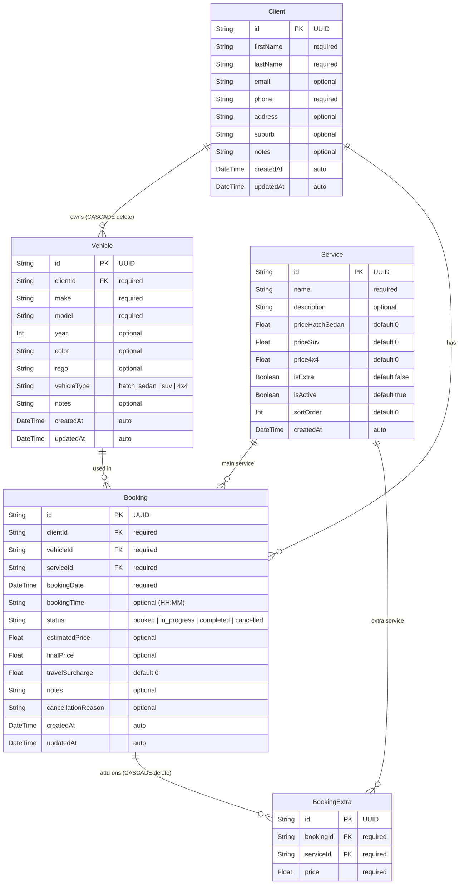
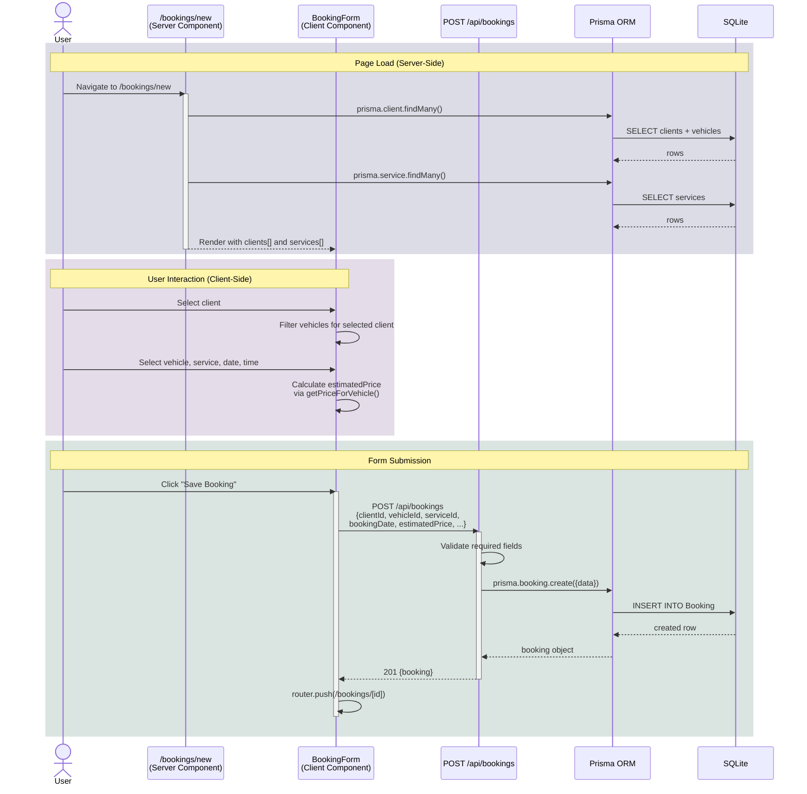
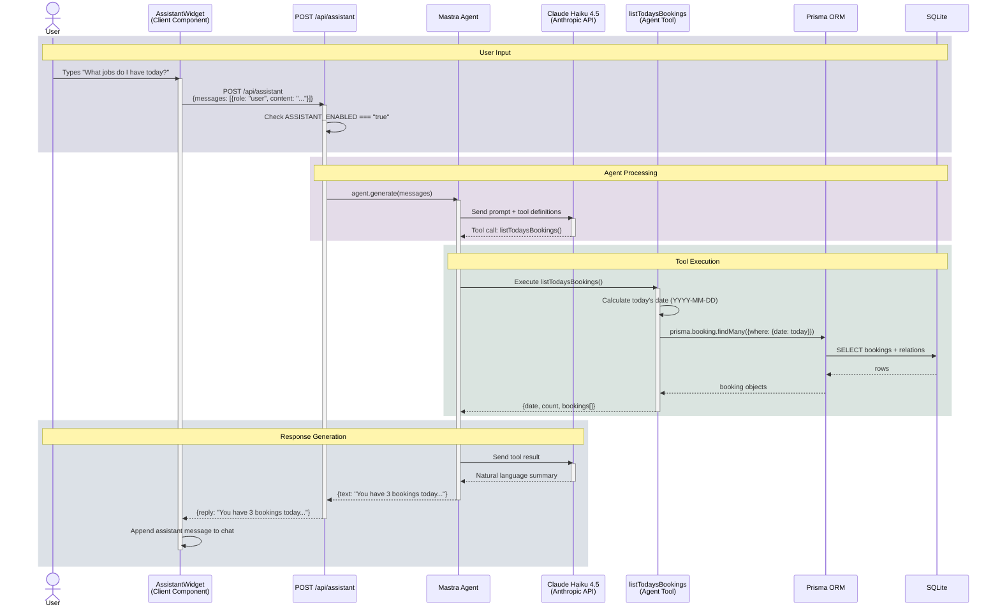
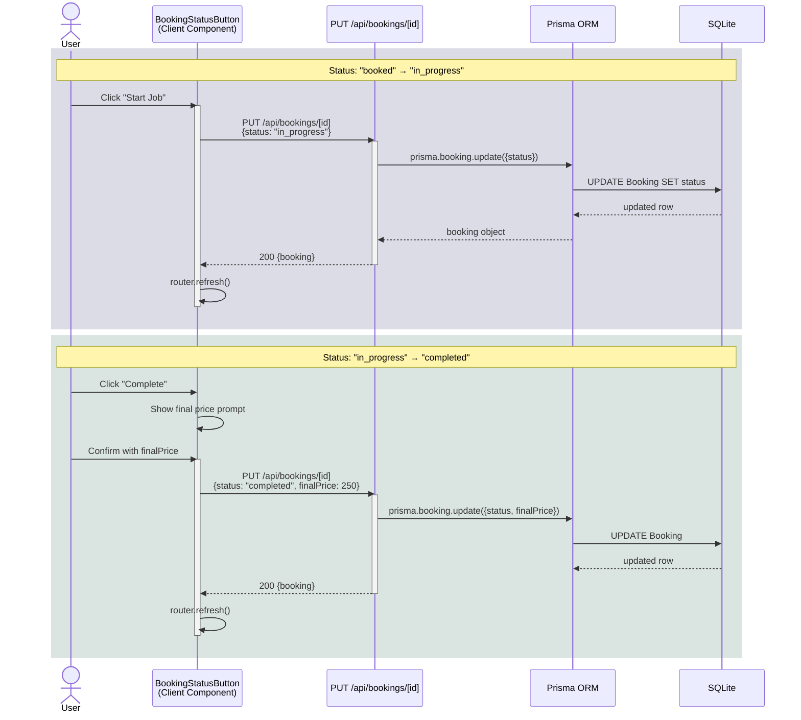

# Low-Level Design — Sunshine Hot Cars

## 1. Entity-Relationship Diagram

## 2. Sequence Diagrams

### 2a. Create Booking Flow

### 2b. AI Assistant Query Flow

### 2c. Update Booking Status Flow

## 3. Component Hierarchy

```mermaid
graph TD
    subgraph Root["RootLayout (app/layout.tsx)"]
        Sidebar["Sidebar<br/><i>client component</i><br/>Nav items, mobile drawer"]
        Main["main container"]
        AssistantWidget["AssistantWidget<br/><i>client component, conditional</i><br/>Floating chat bubble + panel"]
    end

    Main --> DashboardPage["/dashboard<br/><i>server component</i><br/>Stats cards, recent bookings"]
    Main --> ClientsPage["/clients<br/><i>server component</i><br/>Search, client list"]
    Main --> ClientDetailPage["/clients/[id]<br/><i>server component</i><br/>Contact, vehicles, history"]
    Main --> NewClientPage["/clients/new<br/><i>server component</i>"]
    Main --> EditClientPage["/clients/[id]/edit<br/><i>server component</i>"]
    Main --> BookingsPage["/bookings<br/><i>server component</i><br/>Calendar strip, status filter"]
    Main --> NewBookingPage["/bookings/new<br/><i>server component</i>"]
    Main --> BookingDetailPage["/bookings/[id]<br/><i>server component</i><br/>Details, status actions"]
    Main --> HistoryPage["/history<br/><i>server component</i><br/>Date range, filters, revenue"]
    Main --> SettingsPage["/settings<br/><i>server component</i>"]

    NewClientPage --> ClientForm["ClientForm<br/><i>client component</i><br/>Client fields + nested vehicles"]
    EditClientPage --> ClientForm
    ClientDetailPage --> DeleteClientButton["DeleteClientButton<br/><i>client component</i><br/>Confirm + delete"]

    NewBookingPage --> BookingForm["BookingForm<br/><i>client component</i><br/>Client/vehicle/service selection,<br/>date, price summary"]

    BookingDetailPage --> BookingStatusButton["BookingStatusButton<br/><i>client component</i><br/>Start / Complete / Cancel"]

    SettingsPage --> SettingsClient["SettingsClient<br/><i>client component</i><br/>Service list + inline editing"]
    SettingsClient --> ServiceForm["ServiceForm<br/><i>client component</i><br/>Name, prices, flags"]

    style Root fill:#4a1a6b,stroke:#2e0e45,color:#fff
    style Sidebar fill:#1a1a5e,stroke:#0d0d3b,color:#fff
    style AssistantWidget fill:#0d4a2e,stroke:#072e1b,color:#fff
    style Main fill:#1a3a5e,stroke:#0d2440,color:#fff
    style DashboardPage fill:#1a1a5e,stroke:#0d0d3b,color:#fff
    style ClientsPage fill:#1a1a5e,stroke:#0d0d3b,color:#fff
    style ClientDetailPage fill:#1a1a5e,stroke:#0d0d3b,color:#fff
    style NewClientPage fill:#1a1a5e,stroke:#0d0d3b,color:#fff
    style EditClientPage fill:#1a1a5e,stroke:#0d0d3b,color:#fff
    style BookingsPage fill:#1a1a5e,stroke:#0d0d3b,color:#fff
    style NewBookingPage fill:#1a1a5e,stroke:#0d0d3b,color:#fff
    style BookingDetailPage fill:#1a1a5e,stroke:#0d0d3b,color:#fff
    style HistoryPage fill:#1a1a5e,stroke:#0d0d3b,color:#fff
    style SettingsPage fill:#1a1a5e,stroke:#0d0d3b,color:#fff
    style ClientForm fill:#0d4a2e,stroke:#072e1b,color:#fff
    style DeleteClientButton fill:#0d4a2e,stroke:#072e1b,color:#fff
    style BookingForm fill:#0d4a2e,stroke:#072e1b,color:#fff
    style BookingStatusButton fill:#0d4a2e,stroke:#072e1b,color:#fff
    style SettingsClient fill:#0d4a2e,stroke:#072e1b,color:#fff
    style ServiceForm fill:#0d4a2e,stroke:#072e1b,color:#fff
```

